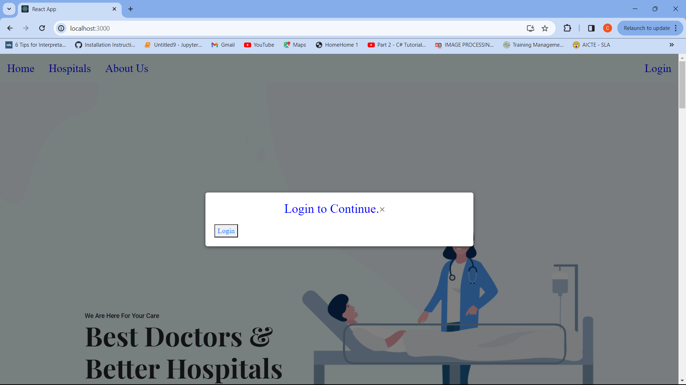

# This is a Community Service Project, developed as a part of my academics.
## Insights:
   ### The Health Service Portal will allow users to discover the types of hospitals available in Narasaraopeta, and access information about all hospitals providing facilities and services. 
   ### This project aims to raise awareness among people to identify a particular hospital when in need.

## The project looks like:

    <!-- First image -->
    
    <!-- Second image -->
    
    <!-- Third image -->
    

## Technologies used:
   ### .HTML
   ### .CSS
   ### .JS------React JS(Fronted), Express JS(Backend)
## Database used:
   ### .MongoDB

