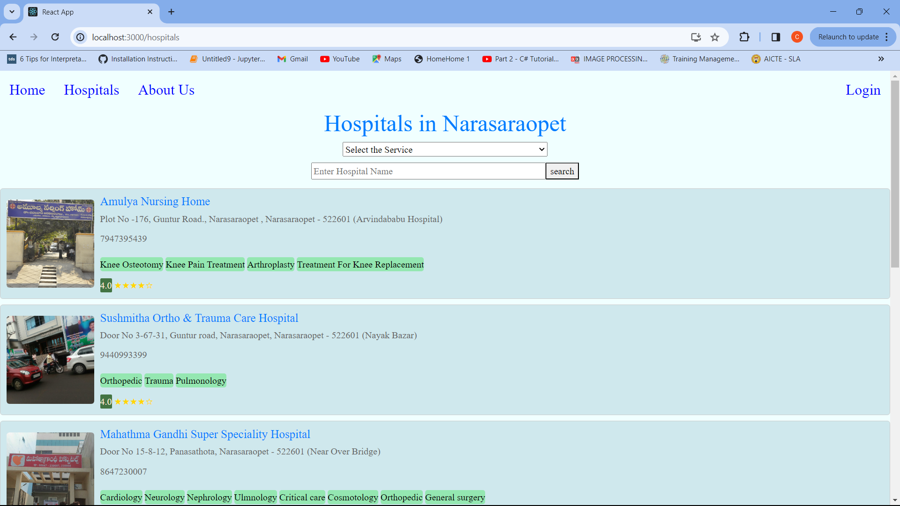
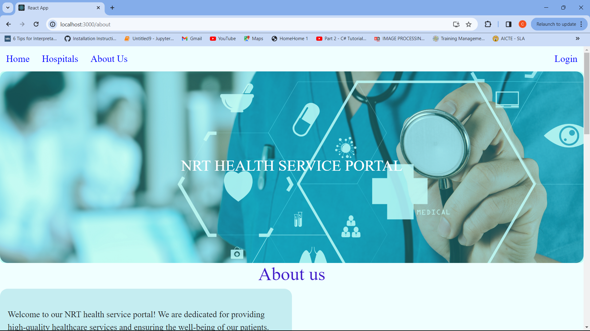
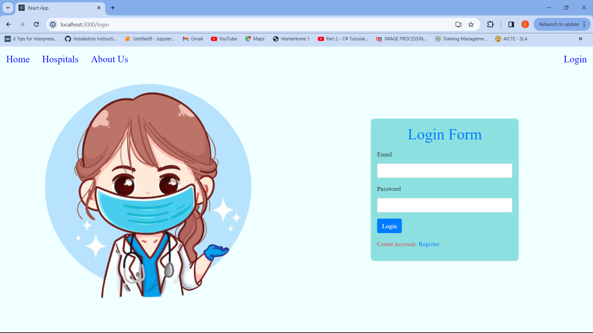
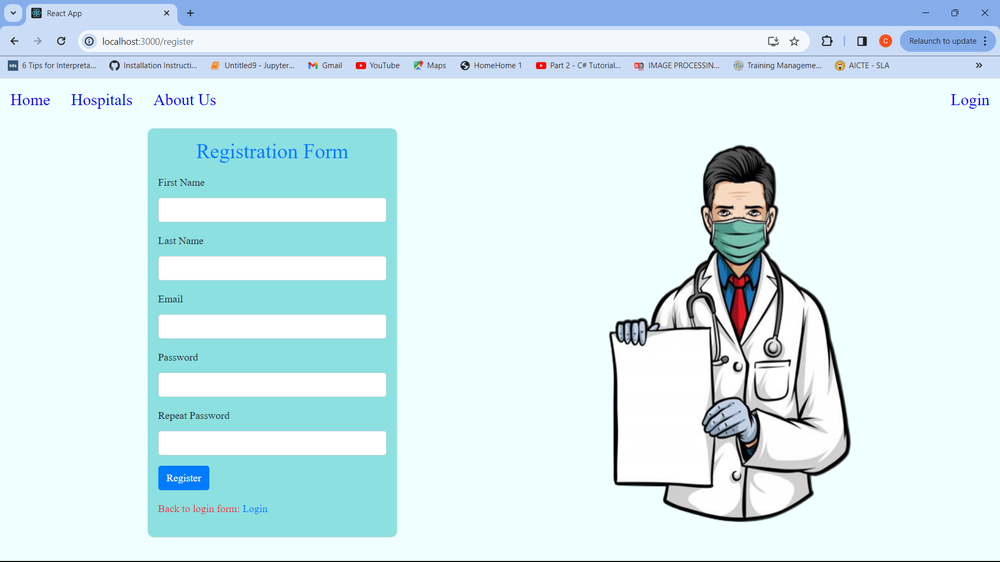
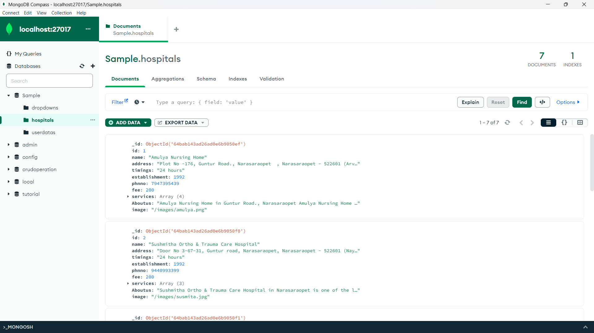

# This is a Community Service Project, developed as a part of my academics.
## Insights:
   ### The Health Service Portal will allow users to discover the types of hospitals available in Narasaraopeta, and access information about all hospitals providing facilities and services. 
   ### This project aims to raise awareness among people to identify a particular hospital when in need.

## The project looks like:
## Home page

    <!-- First image -->
    
    <!-- Second image -->
    
    <!-- Third image -->
    
    <!-- Second image -->
    
    <!-- Second image -->
    
    <!-- Second image -->
    

## Hospitals page

    <!-- First image -->
    
    <!-- Second image -->
    
    <!-- Third image -->
    
    <!-- Fourth image -->
    

## Aboutus page

    <!-- First image -->
    
    <!-- Second image -->
    
    <!-- Third image -->
    
    <!-- Fourth image -->
    

## Login page

    <!-- First image -->
    
    <!-- Second image -->
    

## Register page

    <!-- First image -->
    
    <!-- Second image -->
    

## Data in DataBase

    <!-- First image -->
    
    <!-- Second image -->
    
    <!-- Second image -->
    

## Technologies used:
   #### .HTML
   #### .CSS
   #### .JS------React JS(Fronted), Express JS(Backend)
## Database used:
   #### .MongoDB

## Commands used:
   #### To run the react application:
   #### .../HEALTH_SERVICE_PORTAL> npm start
   #### To run the server:
   #### .../HEALTH_SERVICE_PORTAL/server> npm run dev

